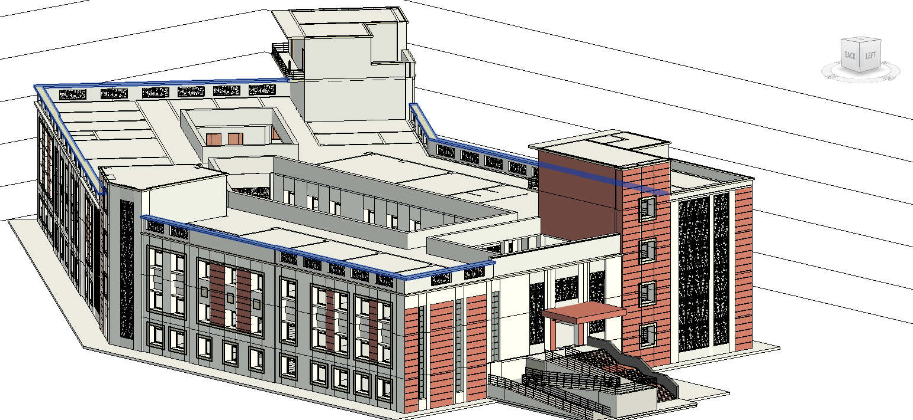

## AR Assistant for College Campus
- Developed an AR-based navigation system where users scan a QR code to access a virtual assistant that guides them to
campus destinations.

- Integrated the AR interface using ARway and created a detailed 3D campus model with Autodesk Revit and Blender.
Simplifies navigation for new students and visitors.

 