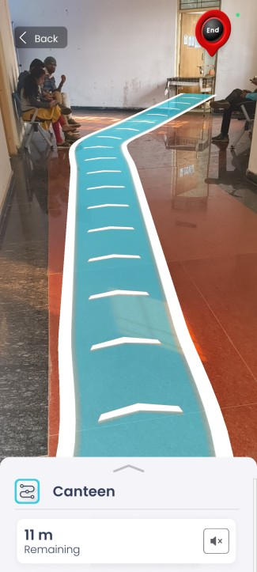

# 📍 AR-Based Campus Navigation System  

AR-based navigation system where users scan a QR code to access a virtual assistant that guides them to
campus destinations.

---

## - **Project Overview**  
This AR-based navigation system allows users to:  
1. **Scan a QR Code** to initialize the virtual assistant.  
2. Receive **real-time directions** and guidance to campus destinations.  
3. Interact with a detailed **3D campus model** for an immersive experience.

---

## - **Key Features**  
- **QR Code Activation:** Users scan a QR code to launch the AR experience.  
- **AR Integration:** Built using **ARway** for seamless augmented reality navigation.  
- **3D Campus Model:** Created a high-quality 3D campus map using **Autodesk Revit** and **Blender**.  
- **User-Friendly:** Designed to assist new students and visitors with intuitive navigation.

---

## - **Tech Stack**  
- **Augmented Reality:** ARway  
- **3D Modeling:** Autodesk Revit, Blender  
- **Development Tools:** ARway, Google ARcore 
- **Other Tools:** ARway QR   

---

[//]: # (## - **Screenshots**  )

[//]: # (Add screenshots or videos showcasing:  )

[//]: # (1. QR Code Scanning  )

[//]: # (2. AR Navigation Interface  )

[//]: # (3. 3D Campus Model in AR  )

---

# 🖥️ **How to Use**  

## 1. **Setup:**  
   
   - Scan the QR code at Entrance.
   - It install the  ARway app.

## 2. **Navigation:**  
   - Follow the AR assistant to reach your desired destination on campus.  

## 3. **Experience:**  
   - Enjoy an immersive, interactive 3D view of the campus.

[//]: # (---)

[//]: # (## 🧩 **Future Improvements**  )

[//]: # (- Add voice-based assistance for navigation.  )

[//]: # (- Enable multi-language support for a diverse audience.  )

[//]: # (- Integrate real-time updates for events or announcements.  )

---

[//]: # ()
[//]: # (## 🤝 **Contributing**  )

[//]: # (Contributions are welcome! If you'd like to improve this project, fork the repository and submit a pull request.  )

[//]: # ()
[//]: # (---)

##  - **3D Model of College Made on Revit Architecture Software**  

## 📄 **License**  
This project is licensed under the APACHE2.O  License. See the [LICENSE](LICENSE) file for details.

---

 